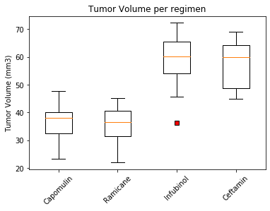
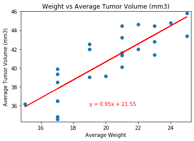

# Analysis on Drug performance.#

## Project overview:

This project is about screening for potential treatments for squamous cell carcinoma (SCC), a commonly occurring form of skin cancer.
In a recent animal study, 249 mice identified with SCC tumor growth were treated through a variety of drug regimens. Over the course of 45 days, tumor development was observed and measured. The purpose of this study was to compare the performance of Pymaceuticals' drug of interest, Capomulin, versus the other treatment regimens.The goal is to provide the technical report of the studyas well as a top-level summary of the study results.

## Jupyter Notebook code:

Here are the steps we undertook to run the analysis. You will be able to read the code in the Jupyter Notebook named 'pymaceuticals_starter'.
  
- Checked if there were any duplicates and removed them 
- Generated a summary statistics table showing the mean, median, variance, standard deviation, and SEM of the tumor volume for each drug regimen.
- Generated a bar plot using both Pandas DataFrame.plot() and Matplotlib's pyplot (due to Uni requirements) showing the total mice for each treatment regimen

- Generated a pie plot using both Pandas's `DataFrame.plot()` and Matplotlib's `pyplot`(due to Uni requirements) that shows the distribution of female or male mice in the study.

- Calculated the final tumor volume of each mouse across four of the most promising treatment regimens: Capomulin, Ramicane, Infubinol, and Ceftamin. 
- Calculated the quartiles and IQR and quantitatively determine if there are any potential outliers across all four treatment regimens.
- Generated a box and whisker plot of the final tumor volume for all four treatment regimens and highlight any potential outliers in the plot by changing their color and style.

- Selected a mouse that was treated with Capomulin and generate a line plot of time point versus tumor volume for that mouse.
- Generated a scatter plot of mouse weight versus average tumor volume for the Capomulin treatment regimen.
- Calculated the correlation coefficient and linear regression model between mouse weight and average tumor volume for the Capomulin treatment.

**Conclusion:**
-The data: The data for Capomulin and Ramicane treatment is normally distributed. Also the data for these two treatments has the least variability with standard deviations and standard errors being the smallest compare to the other treatments.

-Analysis of the whisker plots: The mice who followed Capomulin and Ramicane treatment have the smallest tumor volume size at the end of the treatment - the median volume is respectively 38.12mm3 and 36.56mm3 (compare to the tumors volume of the other treatments Infubinol and Ceftamin close to 60mm3).

-Analysis of the mouse s185 with Capomulin treatment: We can conclude Capomulin treatment has been effective on mouse s185. The tumor volume reduced almost by half between the start and the final timepoint of the treatment.

-Correlation between weight and tumor volume on the Capomulin regimen: There is a strong positive correlation between weight and tumor size - correlation coefficient is 0.84. This means the bigger the mouse is, the bigger the tumor volume is.
